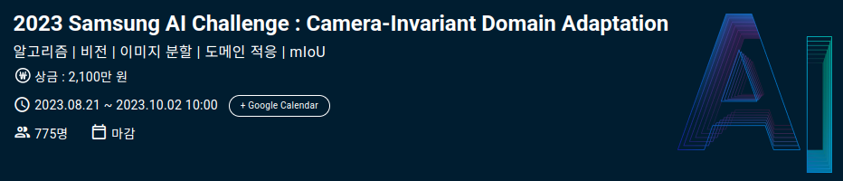

# Fisheye Domain Adaptation for Semantic Segmentation
This repository contains the solution for a competition focused on developing an AI algorithm for high-performance semantic segmentation under geometric distortion, specifically targeting fisheye camera images in autonomous driving scenarios.

# 📝 Background
Autonomous driving relies on various sensors to perceive the environment and control the vehicle. Camera sensors, however, face a **domain gap** due to factors like mounting position, sensor type, and driving conditions. While prior studies have widely applied **Unsupervised Domain Adaptation (UDA)** to address gaps in photometry and texture, most have overlooked the **geometric distortion** caused by camera optics, such as fisheye lenses.

This competition aims to leverage undistorted images (Source Domain) and their labels to achieve robust semantic segmentation on distorted images (Target Domain).

# ✨ Key Details
- **Participants**: Seungchan Kwon, Kihun Kim, Gyuil Lim
- **Model Used**: SegFormer
- **Core Method**: Fisheye Domain Adaptation
- **Scores**:
  - Public Score: 0.60817
  - Private Score: 0.6188
